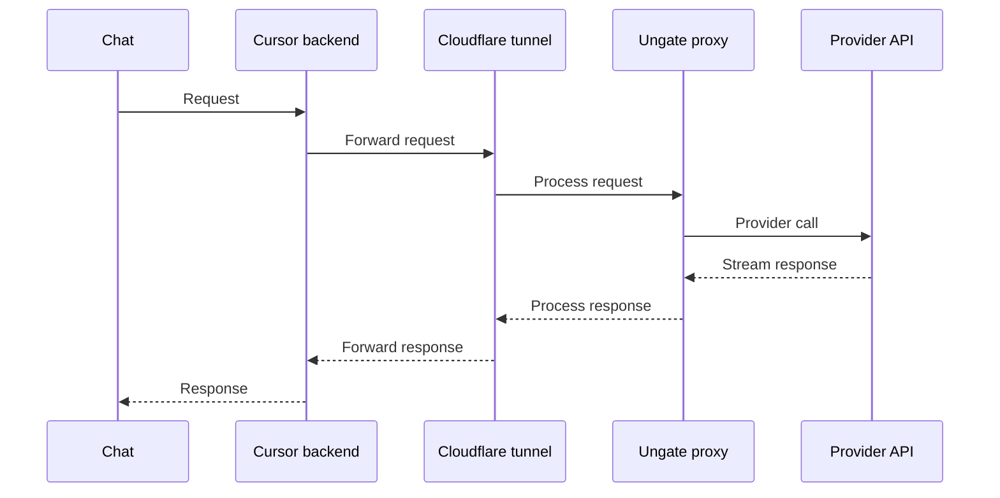

<p align="center">
  
</p>

<h3 align="center">Ungate</h3>

<p align="center">
  A Cursor-first extension for using Claude, ChatGPT, and MiniMax subscriptions in Cursor<br/> instead of paying for API tokens.
</p>

<p align="center">
  <a href="https://open-vsx.org/extension/orchidfiles/ungate"></a>
  <a href="./LICENSE"></a>
  <a href="https://github.com/orchidfiles/ungate"></a>
</p>

## How it works

Ungate lets you use Claude, ChatGPT, and MiniMax in Cursor through account subscriptions instead of direct API token billing. Claude and ChatGPT authenticate via OAuth; MiniMax uses provider API credentials.

Cursor allows a custom OpenAI Base URL. Ungate listens on that URL and translates requests to the target provider API, including streaming, tool calls, and vision where supported.

The extension manages the tunnel that makes the proxy reachable to Cursor's backend and shows its settings in a Webview panel. From there you configure providers, copy the public proxy URL, and copy the proxy API key that Cursor uses to authenticate to your local proxy.

The status bar item shows separate API and tunnel state. Hover it to inspect the current tunnel URL and use quick actions for opening the dashboard, restarting the tunnel, and copying the tunnel URL.

Cursor also has a bug where `OpenAI API Key` turns itself off in settings every few hours. Ungate can keep it enabled automatically and lets you control this behavior from the status bar tooltip and the dashboard.

## Architecture



## Features

- [x] OpenAI-to-provider request translation
- [x] Streaming responses
- [x] Tool calls mapping
- [x] Image support
- [x] OAuth authentication via Claude or ChatGPT account
- [x] MiniMax API key authentication
- [x] MiniMax `<think>...</think>` reasoning separation
- [x] Request analytics
- [x] Analytics split by provider: Claude, OpenAI, and MiniMax
- [x] Built-in web UI panel
- [x] Keeps `OpenAI API Key` enabled when Cursor turns it off on its own

## Provider support

| Capability | Claude | OpenAI | MiniMax |
| --- | --- | --- | --- |
| Authentication | OAuth | OAuth | API key |
| Streaming | Yes | Yes | Yes |
| Tool calls | Yes | Yes | Yes |
| Vision | Yes | No | Yes |
| Reasoning tiers | Yes | No | No |
| Analytics | Yes | Yes | Yes |

## Prerequisites

- Cursor with custom OpenAI provider support enabled.
- Node.js 20+ for local development and manual API runs.
- Outbound internet access for OAuth and provider APIs.
- A reachable public tunnel URL because Cursor backend cannot call `localhost`.

## Installation

Install from the marketplace:

```sh
cursor --install-extension orchidfiles.ungate
```

Or search `@id:orchidfiles.ungate` in the Extensions panel.

[Open VSX](https://open-vsx.org/extension/orchidfiles/ungate)

## Setup

Install the extension, then open the dashboard by clicking the `Ungate` item in the status bar.

### Connect a Provider

Choose the provider you want to use and authenticate with it.  
For Claude and ChatGPT, sign in through OAuth.  
For MiniMax, enter your API key and choose a Base URL: `Global`, `China`, or `Custom`.

### Configure Cursor

1. In the `Tunnel` section, click `Start tunnel`, then copy the public URL shown in the panel.
2. Paste it into `Cursor Settings → Models → OpenAI Base URL`.
3. Copy the proxy API key from the same panel and paste it into `Cursor Settings → Models → OpenAI API Key`.

If Cursor turns `OpenAI API Key` off on its own, Ungate can turn it back on automatically. You can control this from the status bar tooltip and the dashboard.

### Add Models

1. In the `Models` section, copy the model IDs you want and add them as custom models in Cursor.
2. If you use MiniMax, add `MiniMax-M2.7` as a custom model in Cursor.
3. Select one of your custom models in Cursor and start chatting.

## Quick verification

After setup, then send one test message from Cursor using a custom model ID.

If Cursor turns `OpenAI API Key` off on its own, Ungate should turn it back on automatically.

## Known limitations

- Cursor built-in model IDs can bypass `OpenAI Base URL` and go directly to provider APIs.
- Use only custom model IDs copied from Ungate `Models` in Cursor settings.
- If Cursor still bypasses base URL, restart Cursor and re-check model selection.

## Security and privacy

- OAuth and provider credentials are stored locally on your machine.
- Request metadata for analytics is stored in the local SQLite database.
- Tunnel URL and proxy API key are secrets and should be treated like credentials.
- Anyone with both values can send requests through your proxy.
- Rotate your proxy key from the dashboard when you suspect leakage.

## Local build and install in Cursor

```sh
git clone https://github.com/orchidfiles/ungate.git
cd ungate
pnpm install
pnpm run package:build
cursor --install-extension "apps/extension/out/ungate.vsix"
```

## Development

Run the build in watch mode in one step with `Command Palette -> Run Task -> build:watch all`.

Or run it manually in the terminal:

```sh
pnpm --filter @ungate/dev-kit build
pnpm --filter @ungate/shared build:watch
pnpm --filter @ungate/api build:watch
pnpm --filter @ungate/web build:watch
```

After the build, press `F5` to test the extension in Cursor debug mode.

You can also run the API separately from the extension on another port:

```sh
cd apps/api

# use the default database:
PORT=4784 node dist/main.js

# use a separate dev database:
DB_PATH=$HOME/.ungate/data-dev.db PORT=4784 node dist/main.js
```

## Troubleshooting

| Symptom | Check | Fix |
| --- | --- | --- |
| Cursor ignores base URL | Selected model is built-in | Switch to custom model ID from Ungate `Models` |
| `401` from proxy | Cursor API key field | Paste proxy API key from Ungate dashboard |
| `404` or timeout through tunnel | Tunnel status in Ungate panel | Restart tunnel from dashboard |
| OAuth session expired | Provider connection status | Reconnect provider in dashboard |
| Model missing in Cursor | Custom model list in Cursor | Add model ID manually from Ungate `Models` |

## Quick facts

- `localhost` does not work as `OpenAI Base URL` because Cursor calls the endpoint from its backend.
- Tunnel is required for Cursor backend to reach your proxy.
- Built-in provider model IDs can bypass custom base URL routing.
- Provider switch flow: connect provider in Ungate, add its model ID in Cursor, then select that custom model.
- Analytics data and API key is stored in local SQLite files under `$HOME/.ungate/`.

## License

MIT

## Support

Bug reports and feature requests: [GitHub issues](https://github.com/orchidfiles/ungate/issues)  
Everything else: [orchid@orchidfiles.com](mailto:orchid@orchidfiles.com)

---

Made by the author of [orchidfiles.com](https://orchidfiles.com) — essays from inside startups.  
If you found `ungate` useful, you'll probably enjoy the essays.
