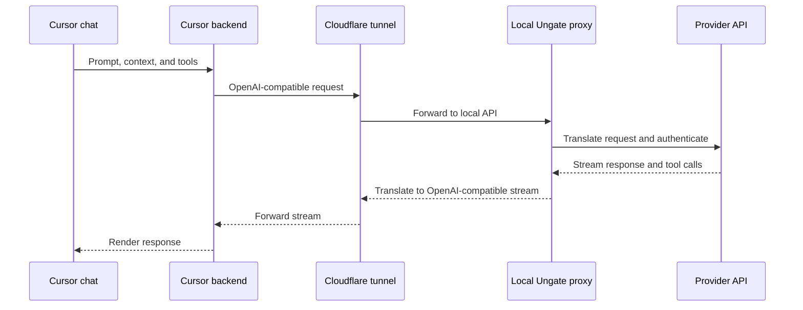

<p align="center">
  
</p>

<h1 align="center">Ungate</h1>

<p align="center">
  Use Claude and ChatGPT subscriptions in Cursor's native chat.<br/>
  Keep Cursor's tools, context, model picker, and diff review.
</p>

<p align="center">
  <a href="https://open-vsx.org/extension/orchidfiles/ungate"></a>
  <a href="./LICENSE"></a>
  <a href="https://github.com/orchidfiles/ungate"></a>
</p>

Ungate is an open-source Cursor extension that lets you work with Claude and ChatGPT in Cursor through the subscriptions you already pay for, instead of paying for API tokens on top. You sign in to both providers with OAuth in the browser, and setup takes about a minute.

Use GPT and Claude in the same Cursor chat: ask GPT to draft a solution, then switch to Claude for a review. When it's time to implement, turn off proxying with the button below the chat and select Composer. Turn proxying back on to continue with GPT or Claude. The entire workflow stays in one chat, with no need to move between separate provider panels.

Under the hood, Ungate takes the custom OpenAI Base URL that Cursor supports and puts a local proxy behind it. The proxy translates each request into the target provider's API format and translates the streamed response back, including tool calls and images where the provider supports them. Because Cursor calls that URL from its own backend rather than from your machine, `localhost` cannot work, so Ungate also runs a Cloudflare tunnel that gives the proxy a public address.

Everything is managed from a dashboard that opens from the `Ungate` item in the status bar: providers, models, the tunnel, and the proxy API key.

Ungate is an unofficial project and is not affiliated with Cursor, Anthropic, or OpenAI. Your subscription limits still apply, and using a subscription through a third-party client may conflict with the provider's terms.

## Install and connect

Before installing, make sure you have Cursor Pro with custom OpenAI provider settings enabled, an account with access to the models you want to use, and Node.js 22, 24, 25, or 26. Node 20 and 23 are not supported.

Install the extension from [Open VSX](https://open-vsx.org/extension/orchidfiles/ungate), find it in Cursor's Extensions panel by searching for `@id:orchidfiles.ungate`, or run:

```sh
cursor --install-extension orchidfiles.ungate
```

### 1. Connect your account

Open the dashboard by clicking `Ungate` in the status bar, then go to the provider settings.

Claude and ChatGPT sign in through the browser. For Claude, finish the login by pasting the authorization code it returns into the dashboard. You do not need the Claude Code CLI or the Codex CLI for any of this.

If you use MiniMax, enter your API key and pick the Base URL that matches your account: `Global`, `China`, or `Custom`.

### 2. Configure Cursor

Start the tunnel from the dashboard and copy its public API URL, including the `/v1` suffix. Then open `Cursor Settings → Models → API Keys` and fill in two fields:

1. Paste the URL into `Override OpenAI Base URL` and enable the override.
2. Paste the proxy key from the Ungate dashboard into `OpenAI API Key` and enable it.

The proxy key only authenticates requests to your local proxy. It is not a Claude, ChatGPT, or MiniMax credential.

### 3. Select a custom model

Copy a model ID from Ungate's Models settings and add it to Cursor as a custom model, using exactly the same ID. Select that model in chat and send a test message. When the request shows up in Ungate's Logs or Analytics, you know Cursor is going through your proxy rather than another provider route.

Always pick the custom entries you added, not Cursor's built-in models: built-in entries can bypass the Base URL override.

## Models and provider support

| Capability | Claude | ChatGPT | MiniMax |
| --- | --- | --- | --- |
| Authentication | Browser OAuth | Browser OAuth | API key |
| Streaming | Yes | Yes | Yes |
| Agent tool calls | Yes | Yes | Yes |
| Images | Yes | No | Yes |
| Reasoning controls | Model-dependent presets | Model-dependent presets | Streamed reasoning separation |
| Request analytics | Yes | Yes | Yes |

For Claude, the presets cover Sonnet and Opus, with reasoning variants on the models that support them. Claude also gets Cursor's MCP tools: discovery, tool calls, and resources pass through as they are.

For ChatGPT, the presets cover GPT/Codex models, GPT-5.6 Sol, Terra, and Luna, and GPT-6 Astra, with standard or priority service tiers where the model offers them. Astra uses `ungate-astra-*` IDs because Cursor rejects its upstream model name before the request ever reaches Ungate.

For MiniMax, you can choose the regional endpoint, and Ungate separates the streamed `<think>...</think>` reasoning from the answer, so the two no longer arrive mixed in one block of text.

The Models settings list the IDs configured in your installation, and you can add your own mappings. A mapping does not grant access to a model, though: what you can actually use still depends on your provider account and on what the upstream model supports.

## Day-to-day use

With proxying enabled, switch between connected providers by choosing another custom model ID in the model picker. With proxying off, built-in models such as Composer use Cursor's normal billing and routing.

The local API starts together with the extension, while the tunnel starts only when you ask for it. Both need your computer to stay online. A restarted quick tunnel may get a new URL, so update Cursor's Base URL whenever that happens.

The status bar shows the state of the API and the tunnel. Its tooltip has shortcuts for opening the dashboard, restarting the tunnel, and copying the URL. Click the proxy toggle beside the chat to switch between Ungate's custom models and Cursor's built-in models such as Composer. The dashboard holds provider settings, models, request analytics, and separate API and tunnel logs. Runtime state and logs are shared across all your Cursor windows.

When the proxy toggle is off, Cursor's built-in models use Cursor's normal routing. Turn the toggle back on to resume using Ungate's custom models.

Claude credentials refresh automatically. ChatGPT sessions expire after a while; when that happens, reconnect the account from the dashboard.

## Ungate vs official provider extensions

Claude Code (`anthropic.claude-code`) and Codex (`openai.chatgpt`) each bring their own agent into the editor. Ungate takes the opposite approach and plugs provider models into the agent workflow Cursor already has.

| | Claude Code / Codex extensions | Ungate |
| --- | --- | --- |
| Chat interface | Separate provider panel | Cursor's native chat |
| Context and history | Managed by the provider agent | Managed by Cursor |
| Tools and change review | Provider agent workflow | Cursor tools and diff review |
| Providers | One per extension | Claude, ChatGPT, and MiniMax |
| Switching providers | Separate conversations | Model selection in the same chat |
| Provider approval | Official clients | Unofficial integration |

If you need a workflow sanctioned by the provider, use the official clients. If you want your subscriptions inside Cursor's native interface, with the model picker, context, and diff review you already know, that is what Ungate is for.

## Why the tunnel is necessary

Cursor sends requests to your custom Base URL from its backend, not from your computer. To that backend, `localhost` means its own machine, not yours.

Ungate solves this with a Cloudflare quick tunnel that exposes the local proxy over HTTPS. You don't need to open inbound ports, set up port forwarding, or create a Cloudflare account.


```mermaid
sequenceDiagram
  participant Chat as Cursor chat
  participant Backend as Cursor backend
  participant Tunnel as Cloudflare tunnel
  participant Proxy as Local Ungate proxy
  participant Provider as Provider API

  Chat->>Backend: Prompt, context, and tools
  Backend->>Tunnel: OpenAI-compatible request
  Tunnel->>Proxy: Forward to local API
  Proxy->>Provider: Translate request and authenticate
  Provider-->>Proxy: Stream response and tool calls
  Proxy-->>Tunnel: Translate to OpenAI-compatible stream
  Tunnel-->>Backend: Forward stream
  Backend-->>Chat: Render response
```

In other words, Ungate is a local proxy with a public endpoint. It is not a hosted service and not an offline workflow. It also does not replace your Cursor subscription or change your access to Cursor's own features.

## Limits and privacy

Requests made through Ungate count against your provider quotas like any other usage. Ungate does not raise subscription limits, bypass throttling, or guarantee that a model is available. Its analytics cover only the requests it handled, not your total account usage or the quota you have left.

Credentials, the proxy key, settings, and request analytics are stored locally in SQLite under `~/.ungate/`, with `data.db` as the default database. Stored locally does not mean encrypted.

Prompts, context, and responses still pass through Cursor's backend, Cloudflare, and the selected provider. Running the proxy locally does not stop those services from processing your traffic.

Treat the proxy key as a secret. Anyone who has both the public tunnel URL and the key can send authenticated requests through your proxy and spend your account allowance. If the key leaks, rotate it in the dashboard and update it in Cursor. Stop the tunnel when you are not using it.

Using a subscription through a third-party client may violate the provider's terms, and changes on the provider's or Cursor's side can break compatibility. Use Ungate at your own risk.

## Troubleshooting

| Problem | What to do |
| --- | --- |
| Nothing appears in Ungate logs | Select a custom model copied from Ungate. Check that the Base URL override is enabled and points to the current public URL ending in `/v1`, not `localhost`. |
| Cursor stops using the proxy | Check the OpenAI API key toggle. Enable OpenAI Key Fix if Cursor keeps disabling it. |
| Proxy returns `401` | Copy the proxy key from the dashboard into Cursor again. |
| Provider authentication fails | Check provider status and reconnect the affected account. ChatGPT sessions require a new login when they expire. |
| Tunnel returns `404`, times out, or chat shows `Reconnecting...` | Check API and tunnel state. Restart the tunnel after network interruptions and update Cursor if the URL changes. |
| Model is missing in Cursor | Add the exact ID from Ungate's Models settings as a custom model. |
| Image request fails | Images are not supported on the ChatGPT integration. On supported providers, check API logs for HTTP `413`; request-size and context limits can also apply. |
| API cannot start or reports a Node ABI error | Use Node 22, 24, 25 or 26. To select a specific compatible runtime, set `UNGATE_NODE_BIN` in the extension host's environment. |
| OpenAI Key Fix cannot read Cursor settings | Check `sqlite3` availability. On macOS arm64 and Linux arm64, install the CLI separately and make it available on `PATH`. |

Ungate runs on macOS, Linux, and Windows wherever compatible native binaries are available; on Linux, the prebuilds require glibc. Native components are downloaded at pinned versions and checked against SHA-256 hashes. If an installation fails, do not try to work around the verification.

## Build from source

You need a supported Node.js runtime and pnpm 10:

```sh
git clone https://github.com/orchidfiles/ungate.git
cd ungate
pnpm install
pnpm run package:build
cursor --install-extension "apps/extension/out/ungate.vsix"
```

For development, run `Command Palette → Run Task → build:watch all` and press `F5` to launch the extension in debug mode. The full development workflow and tests are described in [Contributing](CONTRIBUTING.md), and release history is in the [Changelog](CHANGELOG.md).

## Support and contributing

Report bugs and request features in [GitHub Issues](https://github.com/orchidfiles/ungate/issues). For questions and setup help, see [Support](SUPPORT.md). Contributions are welcome; please follow [Contributing](CONTRIBUTING.md) and the [Code of Conduct](CODE_OF_CONDUCT.md).

Report vulnerabilities privately as described in [SECURITY.md](SECURITY.md), and keep credentials and unsanitized request logs out of public reports.

## License

[MIT](LICENSE)

---
  
Made by the author of [orchidfiles.com](https://orchidfiles.com/)
